# Avroleva Elevators

Avroleva Elevators is the elevator product of Avroleva; technical identifiers (package scopes, database and container names, the `/avroleva` base path, cookie names) keep the short name.

Avroleva Elevators is a multi-tenant SaaS for Bulgarian elevator-maintenance firms (асансьорни сервизи). It is the business-operations and customer-evidence layer on top of the paper logbook (дневник): the 30-day functional checks with two technicians, the emergency-call response timer, the 17-item stop-defect catalogue, inspection dates, the monthly report to the building, light invoicing, and the long-term dossier a firm keeps for every lift. Each firm is a tenant with strict data isolation, can export all of its data at any time as CSV or a full zip, and can delete it after a 30-day grace period — the product holds the firm's own operational record for the firm alone.

The office app is a desktop-first React SPA in Bulgarian (English available) with a map of the portfolio, a due board, callbacks, defects, calendar, contracts, invoices, notifications and printable pages (logbook page, defect notice, inspection request, QR labels, monthly building report). Technicians use an offline-first PWA on their phone: enrolled by QR code, it caches today's lifts, records visits with checklist, photos and a second technician's name without a network, and syncs when one returns. Regulator-facing outputs are deliberately out of scope; the vocabulary everywhere is operational.

## Features

- **Register**: customers (ползватели) with contacts, buildings with geocoded addresses and access notes, elevators with intervals and inspection dates, contracts with per-elevator prices, CSV import with preview.
- **Maintenance cycle**: per-elevator interval (30 days by default, rolling or calendar), due board (overdue / today / tomorrow), map pins coloured by due state, "record a visit" from the board or the elevator page, visits with checklist snapshot, photos and quality flags.
- **Callbacks (аварии)**: intake by phone/office or from the public QR page, dispatch, on-site, close-out with cause/action and an automatic visit record; SLA timer with at-risk and breached events.
- **Defects**: catalogue of the 17 stop-lift items plus free text, follow-up clock, notice to the building, "customer requested repair", stop-lift ring on the map until resolved.
- **Calendar**: inspections (periodic, after repair, after stop) with alert steps, alarm-device tests, overdue checks, defect follow-ups — one deadlines view.
- **Money (light)**: monthly invoices per contract with gapless numbering and VAT, payments (full/partial/unallocated), overdue roll, dashboard totals.
- **Notifications**: rule matrix per event × channel (in-app, e-mail, SMS, Viber deep link) × recipient (building contact, owner, office, technician); Handlebars templates in bg/en with per-tenant overrides; delivery log; bell inbox.
- **Reports and exports**: monthly building report (print + e-mail attachment), 13 CSV datasets, full zip export with SHA-256 manifest, delete-my-data with 30-day grace.
- **Technician PWA**: QR enrollment with device sessions, Today list with call/navigate buttons, visit form with checklist, camera, second technician, outbox with retries, forced-update header.
- **Platform admin**: register/deactivate tenants, reset owner passwords, system page (health, worker jobs, failed deliveries, scheduled deletions).
- **Scheduler**: pg-boss in the same Postgres (no Redis) — hourly recompute, daily overdue roll, calendar alerts, SLA watch every minute, retention sweep, orphan cleanup, tenant purge, outbox catch-up.

## Screenshots

| | |
|---|---|
| 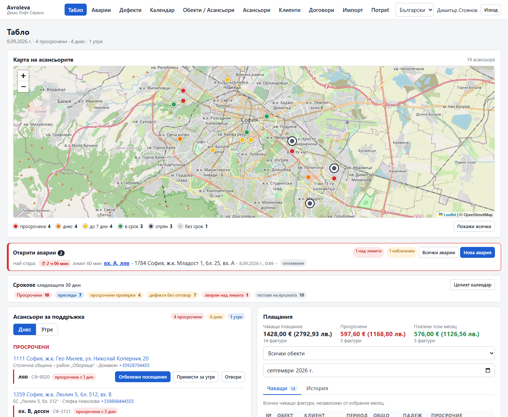 Dashboard: map, due board, payments | 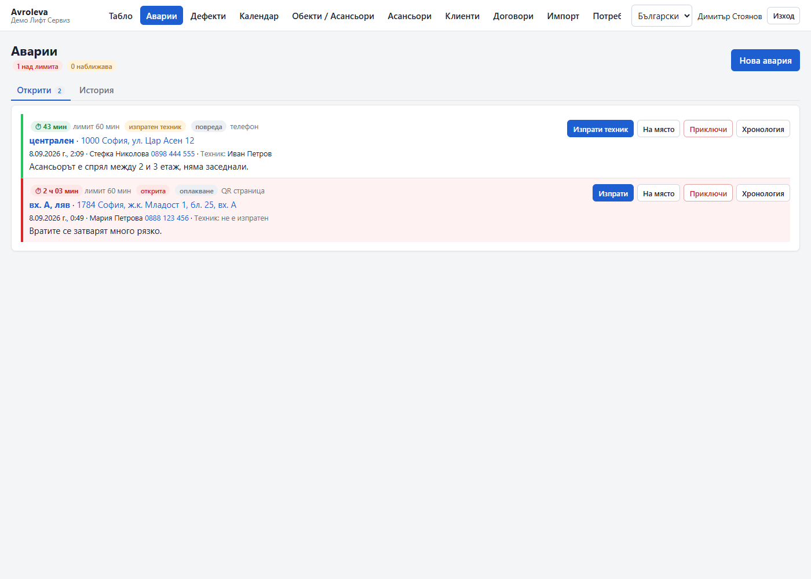 Callbacks with the response timer |
| 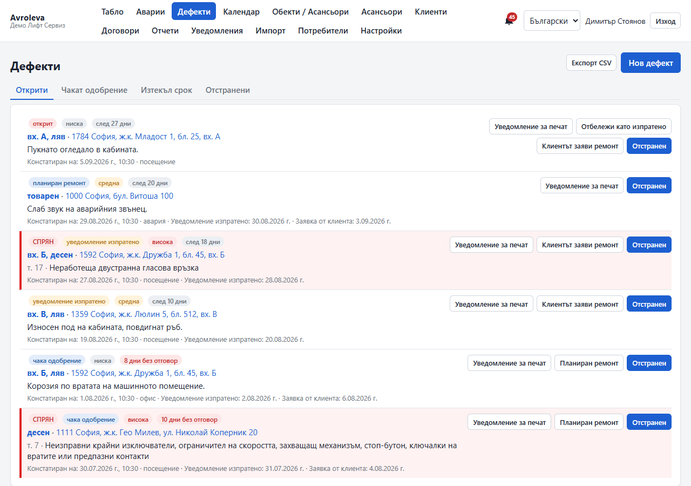 Defects with follow-up clock and stop-lift | 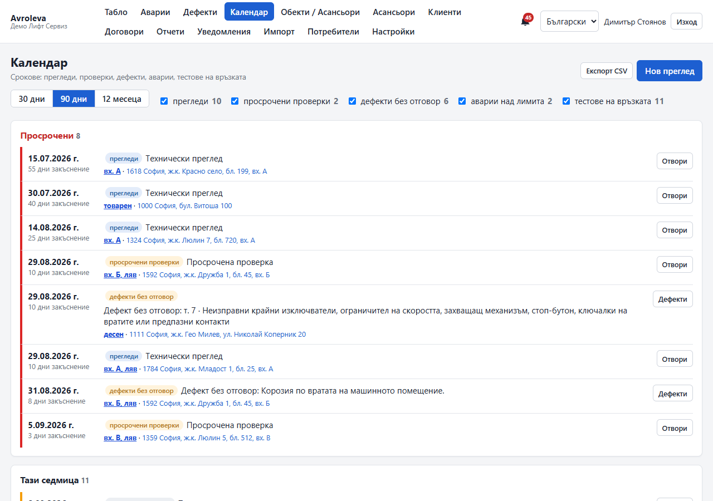 Deadlines calendar |
| 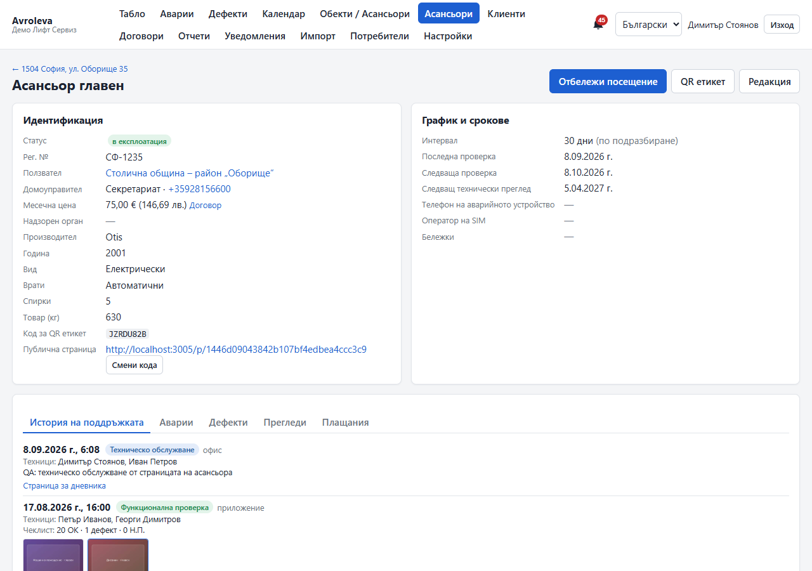 Elevator page with history and photos | 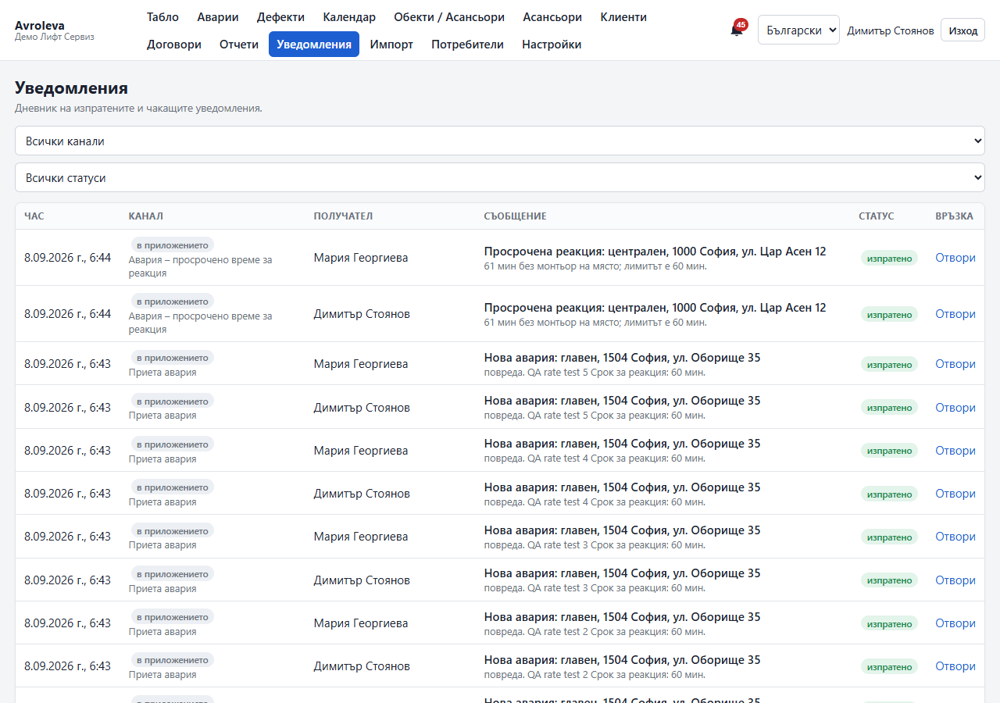 Notifications log with Viber links |
| 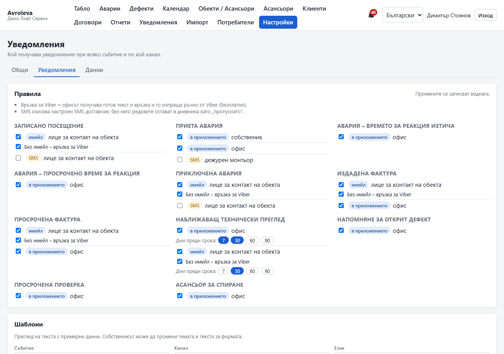 Rules and template editor | 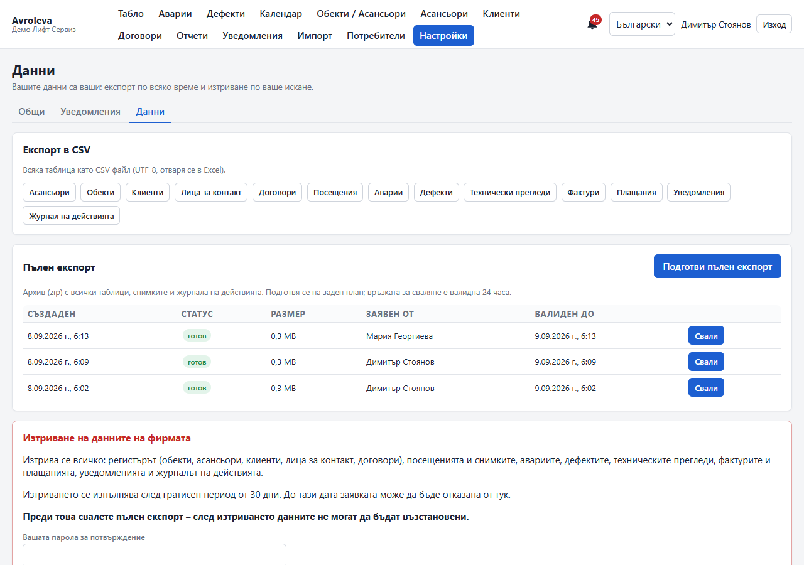 Exports and delete-my-data |
| 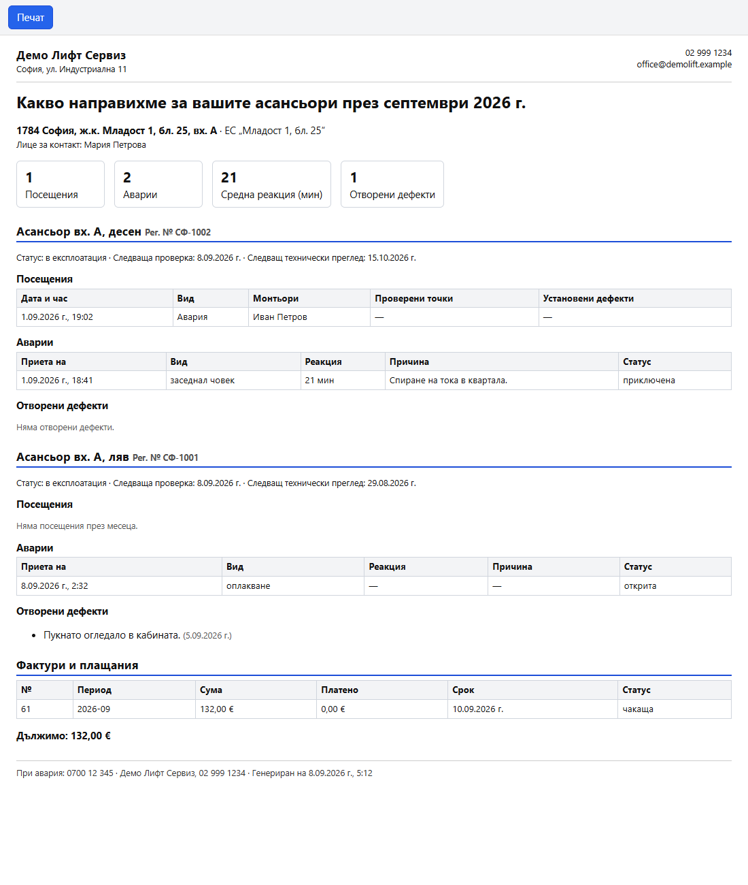 Monthly building report (print) | 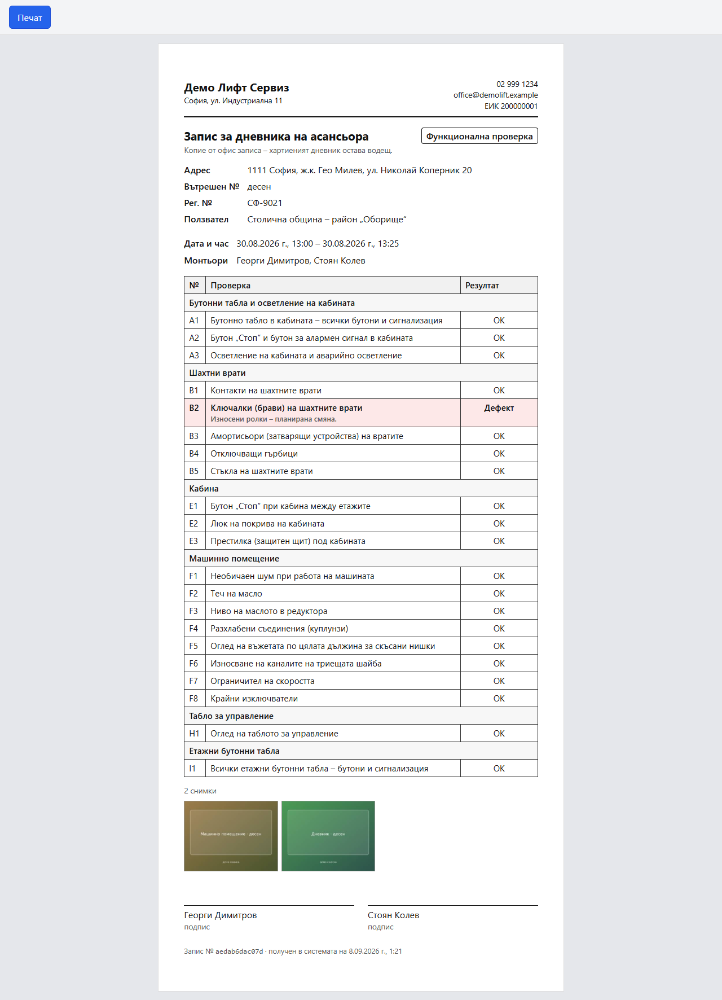 Logbook page (print) |
| 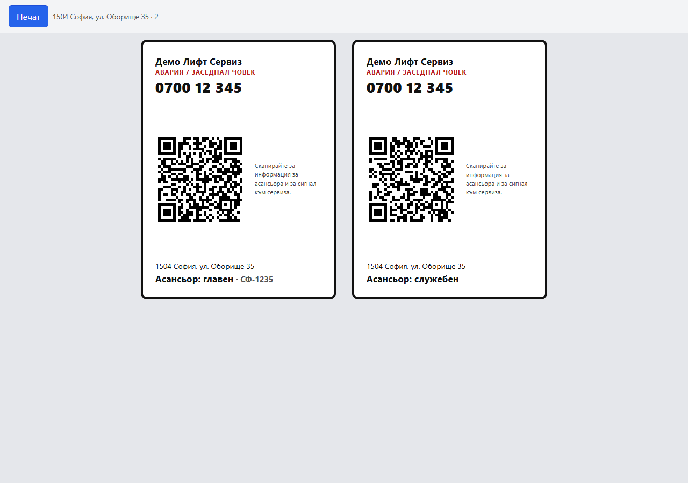 QR label sheet | 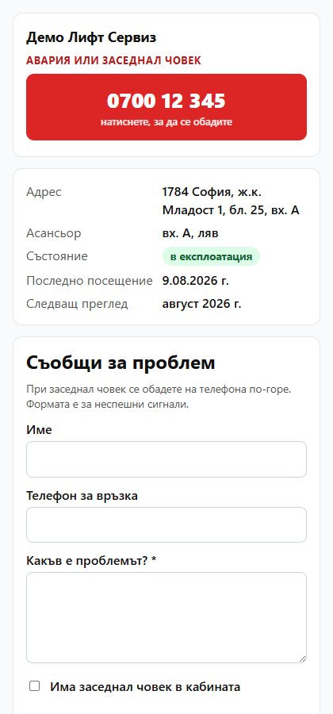 Public QR page with fault form |
| 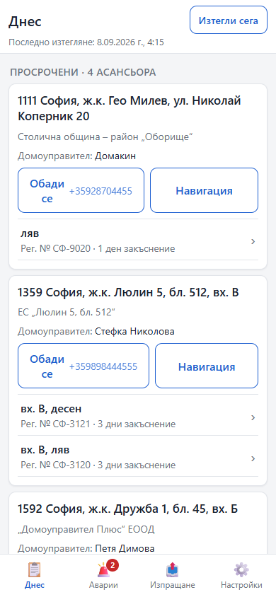 Technician app: Today | 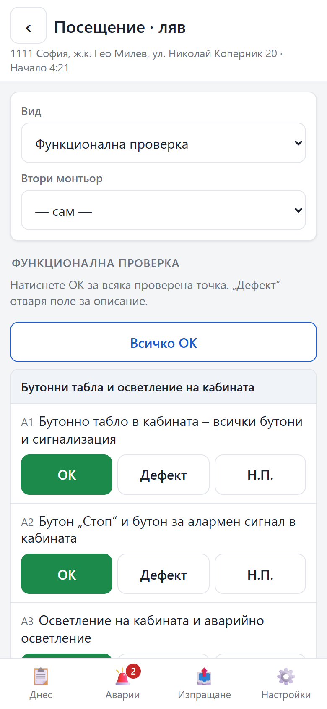 Technician app: visit form |
| 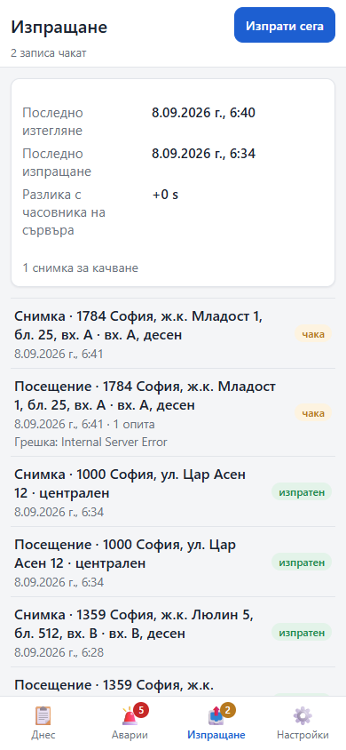 Technician app: outbox while offline | 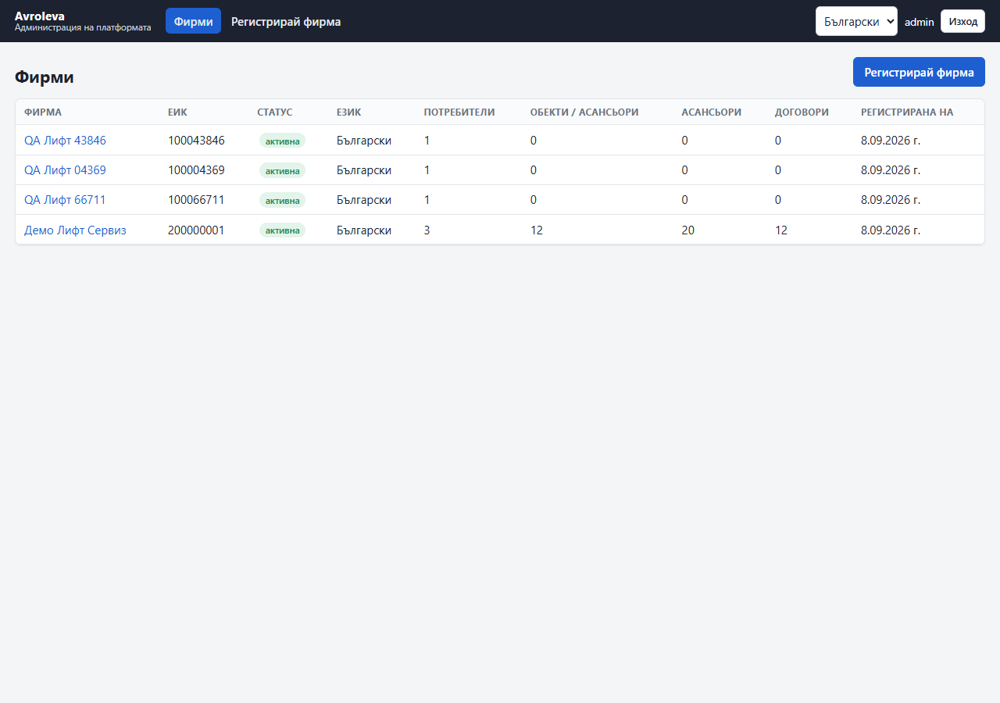 Platform admin |

## Quickstart (local)

Requirements: Node 22+, Docker Desktop (for Postgres). One `.env` at the repo root (copy `.env.example`; the defaults point at the shared dev Postgres container `unclecrm-db` on `localhost:5432`, or start `docker compose up -d db` and point `DATABASE_URL` at `127.0.0.1:5436`).

```bash
npm install
npm run db:migrate        # creates the schema (and avroleva_test for the integration tests)
npm run db:seed           # platform admin + system templates + demo tenant (SEED_DEMO=true)
npm run dev               # API http://localhost:3005, office http://localhost:5175, tech http://localhost:5176/tech/
npm test                  # i18n + API unit/integration tests against avroleva_test
```

`npm run db:reset` drops and reseeds the dev database. Demo logins: owner `demo` / `demo1234`, office `maria` / `demo1234`, technician `ivan` / `demo1234`, platform admin `admin` / `admin12345` at `/admin/login`. Other scripts: `npm run lint`, `npm run typecheck`, `npm run build`.

## Workspace layout

```
apps/api/         Express 5 + Prisma + pg-boss: src/{main.ts, app.ts, worker.ts, jobs.ts, subscribers.ts,
                  http/, modules/<m>/{domain,repo,http,index.ts}, platform/}; prisma/ (schema, migrations, seed); test/
apps/office/      React 19 + Vite 7 office SPA (desktop-first, Leaflet map), built with VITE_BASE
apps/tech/        React 19 + Vite 7 + vite-plugin-pwa + Dexie technician app, served by the API at /tech/
packages/contracts/   zod schemas and DTO types shared by API and clients
packages/domain-data/ checklists, defect catalogue, notification templates, calendar rules
packages/i18n/        bg.json (source) + en.json, t() for server and clients
docker/           Dockerfile (multi-stage) + entrypoint (migrate -> seed -> start)
deploy/           nginx snippet for the /avroleva/ path prefix
scripts/          deploy.sh, backup.sh, restore-drill.sh (VPS)
docs/             screenshots, QA log
```

## Documents

| Document | What it is |
|---|---|
| [`MORNING-REPORT.md`](./MORNING-REPORT.md) | What was built overnight, status, gaps, decisions needed. Start here. |
| [`ARCHITECTURE.md`](./ARCHITECTURE.md) | Modular monolith design: modules and boundaries, adjustability, data model, offline-first PWA, API, cross-cutting concerns, deployment, testing, decisions log. |
| [`MVP-PLAN.md`](./MVP-PLAN.md) | Build plan: phases 0–9, the 2-week demo, the founding-customer import plan, risks, definition of done. |
| [`DEPLOY.md`](./DEPLOY.md) | VPS runbook: deploy key, `.env`, compose, nginx include, backups, restore drill, rollback, decisions before go-live. |
| [`HANDOFF-STEP1.md`](./HANDOFF-STEP1.md) … [`HANDOFF-STEP5.md`](./HANDOFF-STEP5.md) | Per-step handoffs: foundation; dashboard; callbacks/defects/calendar/public page; offline technician app; scheduler/notifications/exports/reports. |
| [`docs/QA-2026-09-08.md`](./docs/QA-2026-09-08.md) | The QA pass: bugs found and fixed, what was exercised, security quick-check. |
| `../Elevator Business Due Diligence/` | The research this design rests on (start with `00-SYNTHESIS.md`). |
| `../Elevator Businesses Data/` | ДАМТН register of licensed firms — the lead list. |

Conventions that apply to all code here: `D:\Code\VPS-GUIDE.md` (Docker, path-based nginx, ports, backups) and `D:\Code\GITHUB-GUIDE.md` (repo-local identity, deploy keys). The GitHub repo name is still to be confirmed with the founder.
