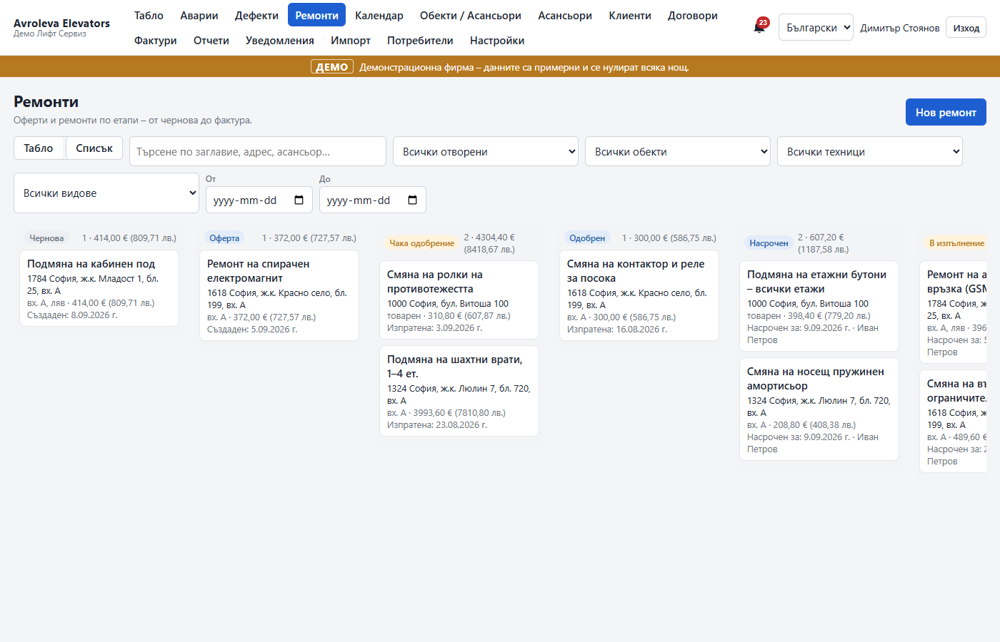
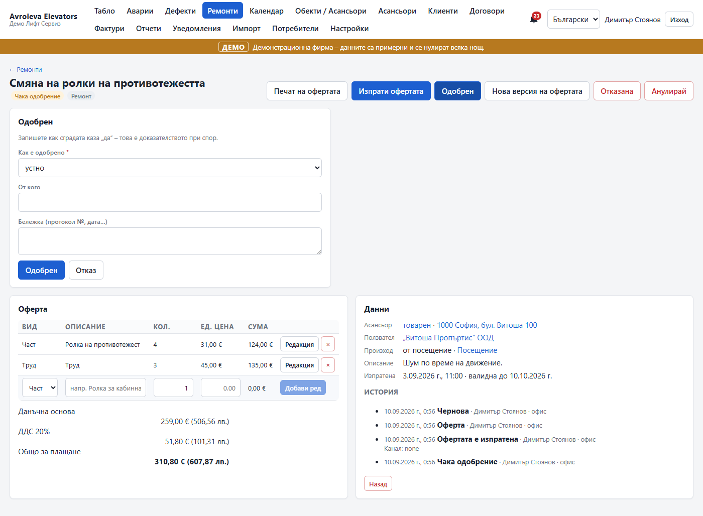
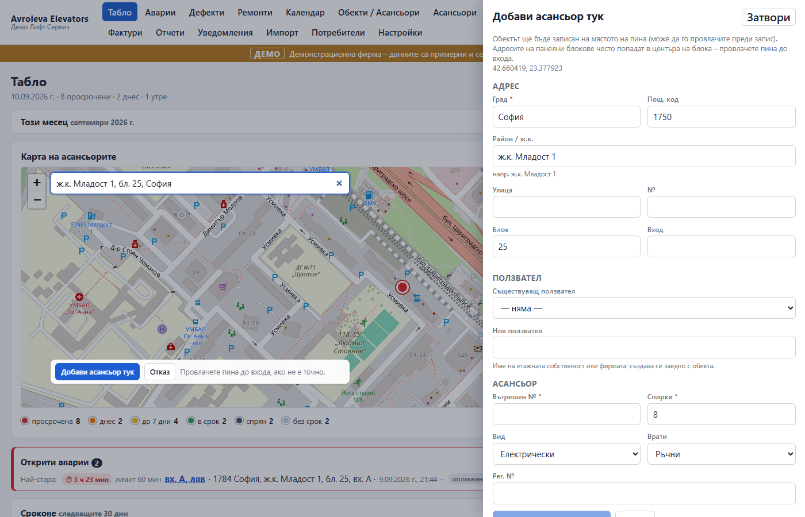
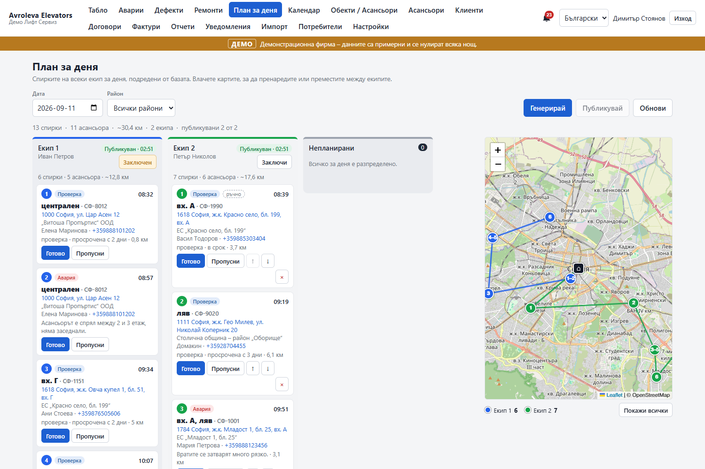
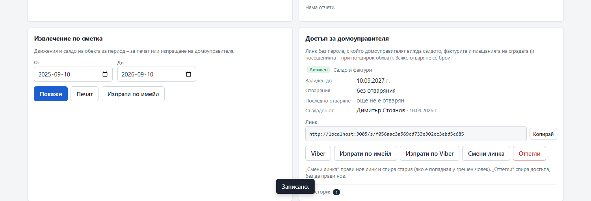
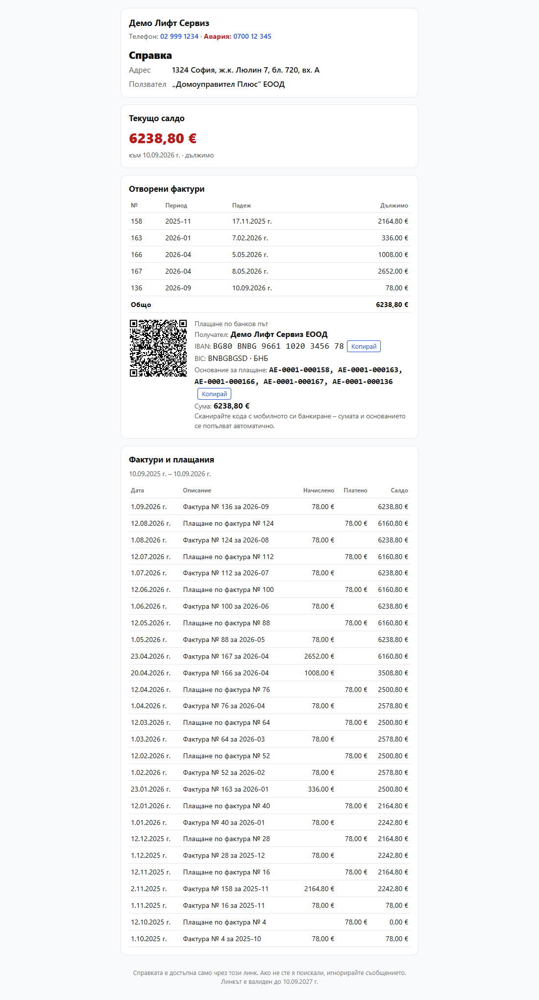

# Avroleva Elevators

Avroleva Elevators is the elevator product of Avroleva; technical identifiers (package scopes, database and container names, the `/avroleva/elevators-v1` base path, cookie names) keep the short name.

Avroleva Elevators is a multi-tenant SaaS for Bulgarian elevator-maintenance firms (асансьорни сервизи). It is the business-operations and customer-evidence layer on top of the paper logbook (дневник): the 30-day functional checks with two technicians, the emergency-call response timer, the 17-item stop-defect catalogue, inspection dates, the monthly report to the building, light invoicing, and the long-term dossier a firm keeps for every lift. Each firm is a tenant with strict data isolation, can export all of its data at any time as CSV or a full zip, and can delete it after a 30-day grace period — the product holds the firm's own operational record for the firm alone.

The office app is a desktop-first React SPA in Bulgarian (English available) with a map of the portfolio, a due board, callbacks, defects, repair jobs and quotes, calendar, contracts, invoices, notifications and printable pages (logbook page, defect notice, inspection request, QR labels, monthly building report, quote). Technicians use an offline-first PWA on their phone: enrolled by QR code, it caches today's lifts, records visits with checklist, photos and a second technician's name without a network, and syncs when one returns. Regulator-facing outputs are deliberately out of scope; the vocabulary everywhere is operational.

## Features

- **Register**: customers (ползватели) with contacts, buildings with geocoded addresses and access notes, elevators with intervals and inspection dates, contracts with per-elevator prices, CSV import with preview.
- **Maintenance cycle**: per-elevator interval (30 days by default, rolling or calendar), due board (overdue / today / tomorrow), map pins coloured by due state, "record a visit" from the board or the elevator page, visits with checklist snapshot, photos and quality flags.
- **Callbacks (аварии)**: intake by phone/office or from the public QR page, dispatch, on-site, close-out with cause/action and an automatic visit record; SLA timer with at-risk and breached events.
- **Defects**: catalogue of the 17 stop-lift items plus free text, follow-up clock, notice to the building, "customer requested repair", stop-lift ring on the map until resolved.
- **Calendar**: inspections (periodic, after repair, after stop) with alert steps, alarm-device tests, overdue checks, defect follow-ups, quotes without an answer — one deadlines view.
- **Repair jobs and quotes** (step 8): a job is the quote (lines with quantity, unit price, VAT once on the total) walking through stages that are data — draft, quoted, awaiting approval, approved (with evidence: assembly protocol, e-mail, Viber, verbal, manager's signature), scheduled with a technician pair, in progress, done, invoiced, plus rejected / cancelled; system defaults with per-tenant overrides. Created from the office, a defect, a closed callback, a visit or an elevator; printable quote, sent by e-mail or as a Viber link; quote revisions keep the old lines; completion records a repair visit (also from the technician's phone, offline); invoices (full or deposit) go through billing; reminders for quotes without an answer; board / list with filters; dashboard strip with the "done, not invoiced" value.
- **Address search and "add an elevator here"**: as-you-type suggestions (Nominatim behind the Geocoder port, Bulgarian labels, biased to the firm's pins) on the dashboard map, the building form and the "place on the map" dialog for buildings without coordinates; the pin is draggable, nearby buildings are offered to attach to, and building + elevator (+ customer) are created in one call.
- **Day plan by zone** (step 9): zones (райони) as tenant data — a polygon drawn on the map and/or district names, buildings assigned automatically with a manual override; technician pairs (екипи) with a vehicle and a home zone; "План за деня" generates one ordered route per pair from what is due that day (checks, callbacks, scheduled jobs, inspections) nearest-neighbour from the firm's base with indicative ETAs and km, drag-and-drop to reorder or move stops between pairs, lock, publish to the phones; stops complete themselves when the visit / callback / job is recorded.
- **Building statement link** (step 9): a password-less magic link (`/s/:token`) the house manager opens to see the balance, open invoices with the EPC QR, the 12-month ledger and, with the wider scope, visits / callbacks / defects; generated, rotated, revoked and sent (e-mail / Viber) from the building page, opens counted; dunning and report e-mails carry it.
- **Money**: scheduled monthly (or quarterly / yearly) invoices per contract with gapless numbering, VAT and a payer reference; dunning as data (reminder stages per tenant, optional late fee); credit notes; payments (partial, over-payment, unallocated) by hand, from a bank-statement CSV import (auto-match by reference or amount + name, manual match for the rest) or through a payment provider port (demo adapter, IRIS/Stripe stubs); EPC QR code + IBAN block on every invoice, statement and the public page; statement per building (print + e-mail); invoices list with bulk actions.
- **Notifications**: rule matrix per event × channel (in-app, e-mail, SMS, Viber deep link) × recipient (building contact, owner, office, technician); Handlebars templates in bg/en with per-tenant overrides; delivery log; bell inbox.
- **Reports and exports**: monthly building report (print + e-mail attachment), 13 CSV datasets, full zip export with SHA-256 manifest, delete-my-data with 30-day grace.
- **Technician PWA**: QR enrollment with device sessions, Today list with the published day plan (Готово / Пропусни offline), call/navigate buttons and the repair jobs assigned to me (start, notes, photos, complete — offline, through the outbox), visit form with checklist, camera, second technician, outbox with retries, forced-update header.
- **Android app** (step 10): the same technician app wrapped with Capacitor 7 — native camera, geolocation, preferences, share, network and deep links behind the platform seams; runtime-configurable server ("Сървър" on the Enroll screen, prefilled from the office QR); signed APK sideloaded from `/downloads/` (install page in Bulgarian with a QR), no store account needed.
- **Platform admin**: register/deactivate tenants, reset owner passwords, system page (health, worker jobs, failed deliveries, scheduled deletions), demo mode per tenant (a year of believable data generated on demand, reset nightly).
- **Scheduler**: pg-boss in the same Postgres (no Redis) — hourly recompute, daily billing run, daily dunning, daily overdue roll, calendar alerts, quote-approval reminders, SLA watch every minute, retention sweep, orphan cleanup, tenant purge, nightly demo reset, outbox catch-up.

## Screenshots

| | |
|---|---|
|  Dashboard: map, due board, payments |  Callbacks with the response timer |
|  Defects with follow-up clock and stop-lift |  Deadlines calendar |
|  Elevator page with history and photos |  Notifications log with Viber links |
|  Rules and template editor |  Exports and delete-my-data |
|  Monthly building report (print) |  Logbook page (print) |
|  QR label sheet |  Public QR page with fault form |
|  Technician app: Today |  Technician app: visit form |
|  Technician app: outbox while offline |  Platform admin |
|  Repair jobs board by stage |  Job: quote lines, evidence, timeline |
|  Address search and "add an elevator here" |  Day plan board with routes per pair |
|  Building access link card |  Statement page behind the magic link |

## Quickstart (local)

Requirements: Node 22+, Docker Desktop (for Postgres). One `.env` at the repo root (copy `.env.example`; the defaults point at the shared dev Postgres container `unclecrm-db` on `localhost:5432`, or start `docker compose up -d db` and point `DATABASE_URL` at `127.0.0.1:5436`).

```bash
npm install
npm run db:migrate        # creates the schema (and avroleva_test for the integration tests)
npm run db:seed           # platform admin + system templates + demo tenant (SEED_DEMO=true)
npm run dev               # API http://localhost:3005, office http://localhost:5175, tech http://localhost:5176/tech/
npm test                  # i18n + API unit/integration tests against avroleva_test
```

`npm run db:reset` drops and reseeds the dev database. Demo logins: owner `demo` / `demo1234`, office `maria` / `demo1234`, technician `ivan` / `demo1234`, platform admin `admin` / `admin12345` at `/admin/login`. Other scripts: `npm run lint`, `npm run typecheck`, `npm run build`.

## Workspace layout

```
apps/api/         Express 5 + Prisma + pg-boss: src/{main.ts, app.ts, worker.ts, jobs.ts, subscribers.ts,
                  http/, modules/<m>/{domain,repo,http,index.ts}, platform/}; prisma/ (schema, migrations, seed); test/
apps/office/      React 19 + Vite 7 office SPA (desktop-first, Leaflet map), built with VITE_BASE
apps/tech/        React 19 + Vite 7 + vite-plugin-pwa + Dexie technician app, served by the API at /tech/;
                  also wrapped as a native Android app (Capacitor 7, android/, docs/ANDROID-RELEASE.md)
packages/contracts/   zod schemas and DTO types shared by API and clients
packages/domain-data/ checklists, defect catalogue, notification templates, calendar rules, billing and job-stage defaults
packages/i18n/        bg.json (source) + en.json, t() for server and clients
docker/           Dockerfile (multi-stage) + entrypoint (migrate -> seed -> start)
deploy/           nginx snippet for the /avroleva/elevators-v1/ path prefix
scripts/          deploy.sh, backup.sh, restore-drill.sh (VPS)
docs/             screenshots, QA log
```

## Documents

| Document | What it is |
|---|---|
| [`MORNING-REPORT.md`](./MORNING-REPORT.md) | What was built overnight, status, gaps, decisions needed. Start here. |
| [`ARCHITECTURE.md`](./ARCHITECTURE.md) | Modular monolith design: modules and boundaries, adjustability, data model, offline-first PWA, API, cross-cutting concerns, deployment, testing, decisions log. |
| [`MVP-PLAN.md`](./MVP-PLAN.md) | Build plan: phases 0–9, the 2-week demo, the founding-customer import plan, risks, definition of done. |
| [`DEPLOY.md`](./DEPLOY.md) | VPS runbook: deploy key, `.env`, compose, nginx include, backups, restore drill, rollback, decisions before go-live. |
| [`HANDOFF-STEP1.md`](./HANDOFF-STEP1.md) … [`HANDOFF-STEP10.md`](./HANDOFF-STEP10.md) | Per-step handoffs: foundation; dashboard; callbacks/defects/calendar/public page; offline technician app; scheduler/notifications/exports/reports; billing that runs itself, payments, demo mode; repair jobs and quotes, address search; zones, day plan, building statement link; native Android app. |
| [`docs/ANDROID-RELEASE.md`](./docs/ANDROID-RELEASE.md) | Android release procedure: rebuild the signed APK, keystore custody, ship it to `/downloads/`, deep links, versioning. |
| [`docs/adr/0001-billing-jobs-payments.md`](./docs/adr/0001-billing-jobs-payments.md) | ADR: billing runs, dunning as data, state machines, payment port, reconciliation, demo mode. |
| [`PHASE2-REPORT.md`](./PHASE2-REPORT.md) | Phase 2 (steps 7–10 + QA): what was added, bugs fixed, test counts, APK rebuild / sideload, what stays stubbed, open decisions. |
| [`docs/QA-2026-09-08.md`](./docs/QA-2026-09-08.md), [`docs/QA-2026-09-10.md`](./docs/QA-2026-09-10.md) | The QA passes (phase 1, phase 2): bugs found and fixed, what was exercised, security quick-checks. |
| `../Elevator Business Due Diligence/` | The research this design rests on (start with `00-SYNTHESIS.md`). |
| `../Elevator Businesses Data/` | ДАМТН register of licensed firms — the lead list. |

## Changelog

### 0.2.0 — 2026-09-10 (phase 2)

- Billing that runs itself: scheduled monthly / quarterly / yearly invoices, dunning as data (reminder stages, optional late fee), credit notes, partial and unallocated payments, bank-statement CSV import with auto-match and manual match, building statement (print + e-mail), EPC QR + IBAN block on every document, payment-provider port with a demo adapter (IRIS / Stripe stubs), demo mode per tenant with nightly reset.
- Repair jobs and quotes: data-driven stages with approval evidence, quote versions, printable quote sent by e-mail / Viber, scheduling with a technician pair, completion (also from the phone, offline) recording a repair visit, full / deposit invoices through billing, dashboard strip with the "done, not invoiced" value.
- Address search and "add an elevator here" on the map; "place on the map" for buildings without coordinates.
- Zones, technician pairs and the day plan (generate, drag-and-drop, lock, publish to the phones); building statement magic link (`/s/:token`).
- Native Android app of the technician PWA (Capacitor, signed APK sideloaded from `/downloads/`), bearer-only device sessions, CORS for the app origin.
- QA pass 2026-09-10: partial settings saves no longer reset the other settings blocks (bank details, provider, jobs, planning); language switch persists; missing notification labels; billing settings writes owner-only; technicians see quote lines without money; quote print favicon. Tests: 367.

### 0.1.0 — 2026-09-08 (phase 1)

Register, maintenance cycle, callbacks, defects, calendar, public QR page, offline technician PWA, scheduler and notifications, exports and reports, monthly invoices, platform admin. See `MORNING-REPORT.md`.

Conventions that apply to all code here: `D:\Code\VPS-GUIDE.md` (Docker, path-based nginx, ports, backups) and `D:\Code\GITHUB-GUIDE.md` (repo-local identity, deploy keys). The GitHub repo name is still to be confirmed with the founder.
